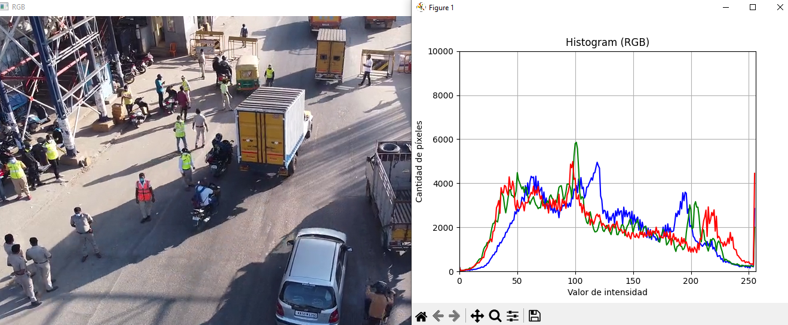

# Video Histogram

Video Histogram es una aplicación que permite visualizar en tiempo real los histogramas de intensidad en escala de grises y RGB de un video o transmisión de cámara web.

## Descripción

Este proyecto utiliza OpenCV y Matplotlib para capturar video de una cámara web o un archivo de video y muestra los histogramas de intensidad de píxeles en tiempo real. La aplicación puede mostrar histogramas en escala de grises o desglosados por canales de color (RGB).

## Características

- **Captura de Video:** Permite capturar video desde una cámara web o un archivo de video.
- **Histograma en Tiempo Real:** Muestra los histogramas de intensidad de píxeles en tiempo real.
- **Modos de Visualización:** Puede mostrar histogramas en escala de grises o desglosados por canales de color (RGB).
- **Interfaz Interactiva:** Utiliza Matplotlib para la visualización de histogramas y permite una actualización dinámica de los gráficos.

## Requisitos

- Python 3.x
- OpenCV
- Matplotlib
- NumPy

## Instalación

1. Clona este repositorio:
   ```bash
   git clone https://github.com/brianrscode/video-histogram.git
   cd video-histogram

2. Crea un entorno virtual (opcional pero recomendado)
```bash
python -m venv env
```
Linux o Mac
```bash
source env/bin/activate
```
Windows
```bash
env\Scripts\activate
```

3. Instala las dependencias
```bash
pip install -r requirements.txt
```

## Uso
1. Ejecuta el script
```bash
python VideoHistogram.py
```

2. Una vez ejecutado, la aplicación mostrará una ventana con el video en tiempo real y otra ventana con el histograma correspondiente.

3. Presiona q para salir de la aplicación.

## Ejemplo de uso
_Visualización del histograma en escala de grises_
<div align="center">
    
</div>

_Visualización del histograma RGB_

<div align="center">
    
</div>